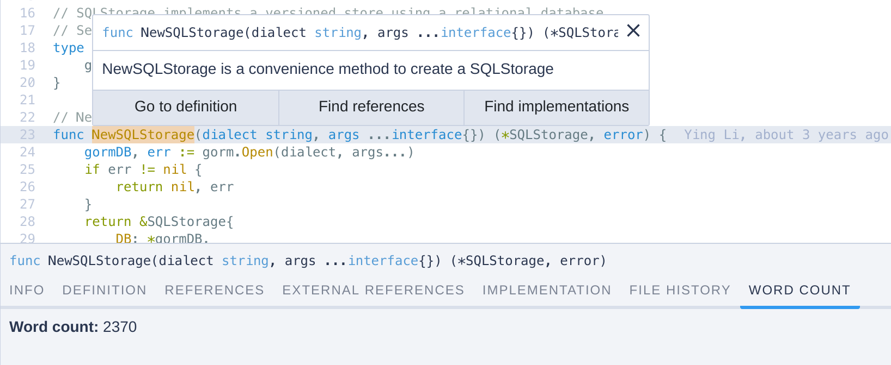

# Word count (Sourcegraph extension)

A sample [Sourcegraph extension](https://github.com/sourcegraph/sourcegraph-extension-api) for counting the number of words in a file.

[**🗃️ Source code**](https://github.com/sqs/sourcegraph-word-count)

[**➕ Add to Sourcegraph**](https://sourcegraph.com/extensions/sqs/word-count)

